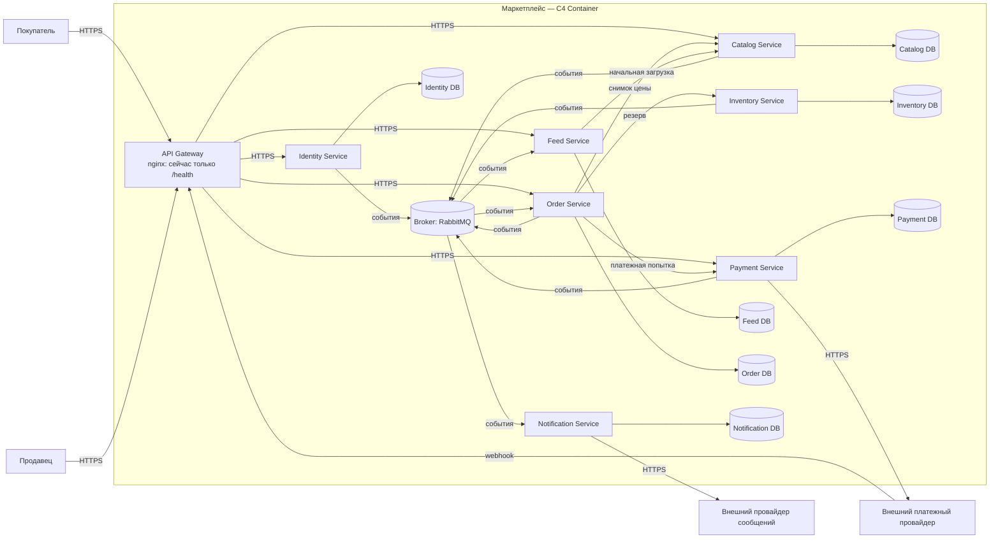
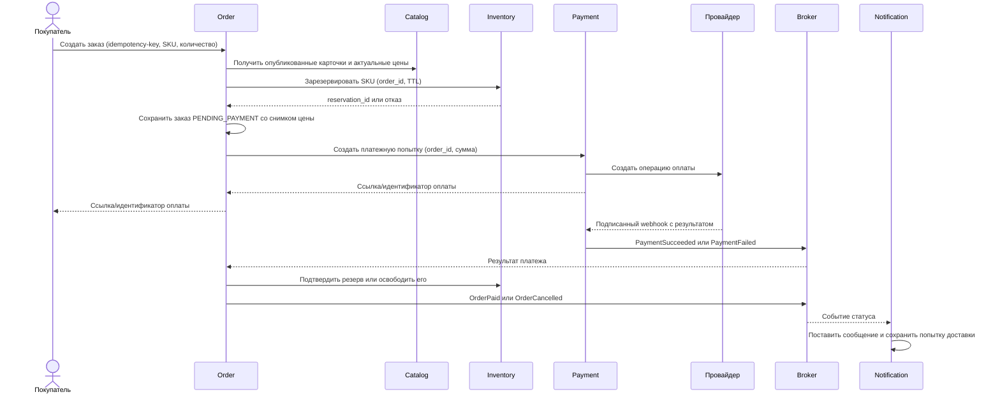

# SOA_1 — архитектура маркетплейса

Домашняя работа по сервис-ориентированным архитектурам: проектирование маркетплейса на уровне **C4 Container** и запуск одного минимального сервиса в Docker.

> **Статус реализации.** Архитектура ниже — проектное решение, а не описание уже работающего маркетплейса. В репозитории реализован только API gateway на nginx: `GET /health` отвечает `200 OK`. Каталог, заказы, платежи и остальные бизнес-функции не реализованы, как и требуется на этом этапе.

## Содержание

1. [Как запустить и проверить контейнер](#как-запустить-и-проверить-контейнер)
2. [Контекст, требования и допущения](#контекст-требования-и-допущения)
3. [C4 Container: состав системы](#c4-container-состав-системы)
4. [Домены, сервисы и границы данных](#домены-сервисы-и-границы-данных)
5. [Взаимодействия и основные сценарии](#взаимодействия-и-основные-сценарии)
6. [Согласованность, надежность и безопасность](#согласованность-надежность-и-безопасность)
7. [Альтернативы декомпозиции и выбор](#альтернативы-декомпозиции-и-выбор)
8. [Архитектурные решения](#архитектурные-решения)
9. [Состав репозитория](#состав-репозитория)

## Как запустить и проверить контейнер

Нужен работающий Docker Engine. Из корня репозитория:

```bash
docker build -t soa-marketplace-gateway:hw1 .
docker run --rm --name soa-marketplace-gateway -p 127.0.0.1:8080:80 soa-marketplace-gateway:hw1
```

Во втором терминале:

```bash
curl -i http://localhost:8080/health
```

Ожидаемый результат:

```http
HTTP/1.1 200 OK
Content-Type: text/plain

OK
```

Для остановки нажмите `Ctrl+C` в первом терминале. Пока контейнер работает, встроенный Docker healthcheck можно проверить командой `docker inspect --format='{{.State.Health.Status}}' soa-marketplace-gateway`. Все остальные пути сейчас возвращают `404`: маршрутизация к проектируемым сервисам появится только после их реализации.

**Почему nginx?** Gateway входит в контейнерную архитектуру и может быть поднят без имитации каталога или платежей. Здесь он намеренно выполняет лишь минимальную проверку запуска. Конфигурация состоит из одного `server` и одного рабочего маршрута, сборка — из обычного `Dockerfile` без Compose и дополнительного приложения.

## Контекст, требования и допущения

### Бизнес-кейс

Маркетплейс соединяет продавцов, размещающих товары, и покупателей, которые изучают ленту и оформляют заказы. Целевая система должна поддерживать:

| Возможность | Что должно быть в целевой системе |
|---|---|
| Лента товаров | Выдача опубликованных и доступных товаров с умеренной персонализацией. |
| Каталог продавца | Создание и изменение карточек, цены, публикации и снятия с публикации. |
| Пользователи | Регистрация, вход, профиль и роли покупателя/продавца. |
| Заказ | Оформление, фиксация состава и цены, смена статусов. |
| Платеж | Создание платежной попытки, учет результата, возврат и сверка с провайдером. |
| Уведомления | Доставка сообщений о значимых изменениях статуса заказа. |

### Рабочие допущения

Они нужны для выбора границ, но не выдаются за требования заказчика:

- Каталог и лента читаются значительно чаще, чем редактируются карточки и создаются заказы. Поэтому чтение ленты можно масштабировать отдельно от записи каталога.
- Продавцов много; одна карточка принадлежит одному продавцу. Заказ может содержать позиции разных продавцов. В первой версии это **один заказ покупателя** с позициями и ссылками на продавцов; разбиение на отдельные отправления/выплаты продавцам — следующий этап.
- Цена подтверждается при оформлении и сохраняется в снимке заказа. Позднее изменение цены в каталоге не меняет уже созданный заказ.
- Внешний платежный провайдер принимает чувствительные платежные реквизиты. Маркетплейс хранит только свои платежные записи и идентификаторы операций провайдера, а не данные карт.
- Сначала используется простая персонализация: интересы по категориям и недавним просмотрам. ML-модель, рекламные ставки, поиск и логистика в объем этой работы не входят.
- Для пользы от независимых сервисов предполагаются рост нагрузки и возможность распределить работу между командами. Если этих условий нет, вариант с модульным монолитом ниже дешевле в эксплуатации.

### Язык предметной области

**Карточка товара** описывает товар и его публикацию; **SKU** — конкретная продаваемая позиция. **Доступный остаток** учитывает резервы. **Резерв** временно удерживает количество на время оплаты. **Заказ** — зафиксированное намерение купить набор SKU по сохраненным ценам. **Платежная попытка** — одна операция оплаты заказа; повторная попытка не создает новый заказ. **Проекция ленты** — копия необходимых для чтения полей карточки, а не первоисточник товара.

## C4 Container: состав системы

Авторитетный исходник диаграммы — [`docs/container.dsl`](docs/container.dsl), формат Structurizr DSL, уровень C4 Container. Внешние люди и системы находятся **вне** границы маркетплейса; внутри показаны исполняемые контейнеры и отдельные хранилища. Наличие контейнера на диаграмме означает целевую архитектуру, а не то, что весь набор уже запускается этим репозиторием.

Проверить исходник официальным валидатором можно без локальной установки Java:

```bash
docker run --rm --mount "type=bind,src=$PWD/docs,dst=/usr/local/structurizr,readonly" structurizr/cli validate -workspace container.dsl
```

Ниже компактное представление той же схемы для чтения прямо в README:



Способ вызова подписан на стрелках: синхронный API и асинхронные события имеют разную семантику. Хранилища не являются общими: каждая стрелка к БД идет только от владеющего сервиса. RabbitMQ — инфраструктурный контейнер передачи событий, а не источник предметных данных. Диаграмма в DSL содержит полные подписи протоколов и событий.

### Что находится на границе системы

- **Покупатель и продавец** — разные роли человека; один аккаунт может иметь обе роли.
- **API gateway** — единая внешняя точка входа для клиентских HTTPS-запросов; в целевой системе маршрутизирует запросы, ограничивает частоту, проверяет базовые свойства токена. Авторизация конкретного изменения повторно проверяется в сервисе-владельце. Сейчас запущен только `/health`.
- **Внешний платежный провайдер** — выполняет списание/возврат и вызывает webhook с результатом.
- **Внешний провайдер сообщений** — доставляет email/SMS; отказ доставки не откатывает заказ или платеж.

### Почему именно Container

Это второй уровень C4: каждая рамка обозначает **отдельно разворачиваемое приложение, хранилище или брокер**, а не класс кода и не физический сервер. Поэтому на схеме видны сетевые связи, владельцы данных и системы снаружи. Уровень Component с контроллерами и таблицами здесь был бы преждевременным.

## Домены, сервисы и границы данных

Каждый домен имеет собственную модель и хозяина изменений. «Своя БД» — логическая граница доступа: для учебной схемы это отдельная БД PostgreSQL с отдельными правами; даже если позднее они физически окажутся в одном кластере, сервис не читает чужие таблицы и не делает межсервисный JOIN.

| Домен / сервис | Зона ответственности и инварианты | Данные, которыми владеет | Не владеет |
|---|---|---|---|
| **Identity** | Учетные записи, роли и аутентификация; только действующий продавец может менять свои карточки. | Аккаунт, профиль, роли, статус продавца, учетные данные/сессии. | Карточки, заказы, платежи. |
| **Catalog** | Карточка и публикация, принадлежность продавцу, актуальная цена; опубликованная карточка имеет валидные обязательные поля. | SKU, описание, категории, изображения/ссылки, цена, владелец, статус публикации и версия. | Остаток и резерв, заказ, предпочтения покупателя. |
| **Inventory** | Остатки и временные резервы; доступное количество не может стать отрицательным. | Остаток по SKU, движения, резерв с TTL и статусом. | Описание товара, финальная цена, платеж. |
| **Feed** | Ранжирование и выдача; читательские копии товара и доступности могут немного отставать. | Проекция опубликованных товаров, агрегаты интересов пользователя, готовые индексы/ранги и позиция обработки событий. | Первичная карточка, остаток, роль и заказ. |
| **Order** | Жизненный цикл заказа и координация оформления; итоговая сумма равна сумме зафиксированных позиций. | Заказ, позиции со снимками цены/названия, адрес доставки, состояние, ключ идемпотентности. | Истинный остаток, платежная операция, профиль. |
| **Payment** | Платежные попытки, результаты, возвраты, журнал операций и сверка; один успешный захват платежа на оплачиваемый заказ. | Платежная попытка, сумма/валюта, идентификатор провайдера, статусы, записи учета и возврата. | Номер карты, карточка товара, статус отправки заказа. |
| **Notification** | Шаблоны и доставка сообщений; повторная обработка одного события не отправляет дубликат. | Задания на отправку, шаблоны, статус доставки, журнал попыток и ключ дедупликации. | Истинный статус заказа, платежный баланс. |

API gateway и брокер не имеют бизнес-домена и не владеют этими данными. Gateway не пишет в БД сервисов. Брокер может хранить сообщения до доставки, но состояние товара или платежа определяется сервисом-владельцем. Ссылки на чужие сущности сохраняются как идентификаторы и снимки, без внешних ключей через границы БД.

### Почему домены распределены именно так

1. **Catalog отделен от Inventory.** Редактирование описания/цены и частые операции резерва имеют разные инварианты и нагрузку. Конкурентные списания остатка не блокируют редактирование карточки. Цена фиксируется Order при оформлении, остаток подтверждается Inventory.
2. **Feed отделен от Catalog.** Каталог — источник изменений, лента — производная модель чтения с персонализацией. Можно менять ранжирование и масштабировать выдачу без миграции записи карточек. Временное отставание ленты допустимо; при оформлении Order проверяет актуальную карточку и резерв.
3. **Order отделен от Payment.** У заказа и денег разные статусы и требования к аудиту. Payment изолирует доступ к провайдеру и финансовым записям. Заказ не трактует HTTP-ответ платежного провайдера как окончательное подтверждение оплаты.
4. **Notification отделен от Order.** Внешняя доставка медленная и ненадежная; успешность заказа не зависит от email/SMS. Шаблоны и повторные попытки развиваются отдельно.
5. **Identity выделен.** Роли используются несколькими доменами, а учетные данные требуют отдельной защиты. При этом проверка права изменять конкретный товар остается у Catalog по `seller_id`.

## Взаимодействия и основные сценарии

### Контракты и способ связи

В таблице **sync** означает запрос-ответ по HTTPS/JSON с таймаутом; **async** — публикацию или чтение события из RabbitMQ. Имена событий и URL — предлагаемые контракты, пока без реализации.

| Отправитель → получатель | Способ | Зачем и что передается |
|---|---|---|
| Клиент → Gateway → Identity | sync | Регистрация, вход, профиль; выдача токена с `user_id` и ролями. |
| Клиент → Gateway → Catalog | sync | Просмотр карточки; продавец создает/меняет собственные карточки. |
| Клиент → Gateway → Feed | sync | Получение ленты; для авторизованного покупателя учитывается `user_id`, для гостя — общая популярность. |
| Клиент → Gateway → Order | sync | Создать заказ с ключом идемпотентности; прочитать свой заказ. |
| Gateway → Payment | sync | Только прием подписанного webhook провайдера через выделенный маршрут; прямого публичного метода «пометить оплаченным» нет. |
| Order → Catalog | sync | Получить актуальные карточки и цену перед созданием снимка заказа. |
| Order → Inventory | sync | Атомарно зарезервировать/подтвердить/освободить количество по SKU. |
| Order → Payment | sync | Создать платежную попытку с `order_id`, суммой и ключом идемпотентности; запросить возврат при необходимости. |
| Payment ↔ провайдер | sync + webhook | Создать операцию/возврат, принять подписанное уведомление и при сомнении сверить статус запросом. |
| Catalog → Broker → Feed | async | `ProductPublished`, `ProductChanged`, `ProductUnpublished`: обновить проекцию товара. |
| Inventory → Broker → Feed | async | `AvailabilityChanged`: обновить приблизительную доступность в ленте. |
| Identity → Broker → Feed/Notification | async | `AccountDisabled`, `ContactChanged`: убрать персонализацию/обновить локальные контакты по необходимости. |
| Feed → Catalog | sync, административный | Полная первоначальная загрузка/восстановление проекции; RabbitMQ не используется как вечный журнал событий. |
| Payment → Broker → Order | async | `PaymentSucceeded`, `PaymentFailed`, `RefundSucceeded`: продвинуть или компенсировать заказ. |
| Order → Broker → Notification | async | `OrderCreated`, `OrderPaid`, `OrderCancelled`: поставить сообщение в очередь доставки. |
| Notification → провайдер сообщений | sync | Отправить email/SMS; сохранить результат и повторить временные сбои. |

Публичные контракты версионируются: путь API может иметь `/v1`, событие содержит `event_id`, `event_type`, `schema_version`, `occurred_at`, `aggregate_id` и полезную нагрузку. Новые необязательные поля добавляются совместимо; удаление/смена значения поля — новая версия с периодом одновременной поддержки. Потребитель должен безопасно пропускать неизвестные необязательные поля.

### Сценарий 1: продавец публикует товар

1. Продавец проходит аутентификацию в Identity и обращается через Gateway в Catalog.
2. Catalog проверяет роль продавца и владение карточкой, валидирует данные и в своей транзакции сохраняет публикацию вместе с записью outbox `ProductPublished`.
3. Отдельный отправитель публикует outbox в RabbitMQ. Feed обрабатывает событие идемпотентно по `event_id` и обновляет свою проекцию.
4. Если Feed временно недоступен, карточка остается опубликованной в Catalog; лента обновится после повторной доставки. Путь пользователя с карточки и оформление опираются на актуальное состояние Catalog/Inventory, а не на старую проекцию Feed.

### Сценарий 2: персонализированная лента

- Feed получает из Catalog только опубликованные карточки, из Inventory — события об изменении доступности. Это **локальная копия для чтения**; Feed не правит цену или остаток.
- Для вошедшего пользователя Feed накапливает легкие сигналы: просмотр категории и выбранные предпочтения. Пример правила: `оценка = свежесть + популярность + интерес_к_категории`; товар без доступности фильтруется или понижается. Никакого ML-сервиса на первом этапе нет.
- Для нового/неавторизованного пользователя используется общая выдача по популярности и свежести. При недоступности персональных сигналов возвращается та же общая выдача, поэтому отказ персонализации не блокирует просмотр.
- В момент оформления Order повторно получает карточку из Catalog и резервирует Inventory. Лента дает кандидатов, но не гарантирует цену или наличие.

### Сценарий 3: оформление и оплата



Порядок действий после оплаты контролирует **Order как оркестратор**. Основные состояния: `PENDING_PAYMENT → PAID → FULFILLMENT_PENDING`; при отказе или истечении срока: `PENDING_PAYMENT → CANCELLED`. Payment имеет собственные состояния попытки (`CREATED`, `PENDING`, `SUCCEEDED`, `FAILED`, `REFUNDED`), которые не подменяют состояние заказа. Если деньги списаны после истечения резерва, Order не сообщает об успешном заказе: инициирует возврат и помечает случай для сверки. Если резервирование не удалось, платежная попытка не создается. Доставка и выплата продавцу здесь не проектируются подробно.

## Согласованность, надежность и безопасность

### Границы транзакций

- Сильная согласованность поддерживается **внутри** одной БД сервиса: например, Inventory атомарно проверяет и уменьшает доступное количество; Payment атомарно записывает изменение платежа и outbox-событие.
- Общей транзакции между Order, Inventory, Payment и провайдером нет. Оформление — **сага с компенсациями**, описанная выше. Order хранит шаг и повторяет незавершенные операции по устойчивому идентификатору заказа.
- Событие создается через **transactional outbox** в той же транзакции, что и изменение состояния. Публикация может повторяться, поэтому обработчики хранят `event_id` и делают операции идемпотентно. Нельзя обещать «ровно один раз» на всей цепочке.
- RabbitMQ доставляет событие как минимум один раз. Для каждой очереди нужны ограниченные повторы и отдельная очередь ошибок. Восстановление Feed после долгого простоя: полная загрузка из Catalog и затем обработка новых событий. Дубли и изменение порядка отдельных событий выдерживаются по версии карточки/SKU.
- Запрос `POST /orders` требует `Idempotency-Key`; повтор с тем же ключом и телом возвращает прежний заказ, а с другим телом — конфликт. Payment передает стабильный ключ провайдеру. Webhook сверяется по подписи, идентификатору операции, сумме/валюте и внутреннему `order_id`.

### Отказы и границы ожидания

| Сбой | Поведение |
|---|---|
| Catalog/Inventory недоступен при создании заказа | Ограниченный таймаут, безопасная ошибка покупателю; заказ не помечается оплаченным. Резервы по ошибочному шагу освобождаются или истекают по TTL. |
| Payment не ответил на создание операции | Order оставляет `PENDING_PAYMENT`, повторяет запрос с тем же ключом; не создает дубль платежа. |
| Webhook не пришел | Payment периодически сверяет незавершенные попытки с провайдером. |
| Событие повторилось или пришло поздно | Проверка `event_id`, версии и допустимого перехода состояния; позднее `PaymentSucceeded` для отмененного заказа ведет к возврату/ручной сверке. |
| RabbitMQ или Notification недоступны | Outbox сохраняет событие; доставка догоняет позже, оформление заказа не ждет email/SMS. |
| Feed отстает/недоступен | При проблеме персонализации — общая выдача из сохраненной проекции; при полном отказе Feed — ошибка чтения, но Catalog и оформление не зависят от Feed. |

### Доступ, персональные данные и наблюдаемость

- Внешний трафик идет по HTTPS; межсервисное соединение защищается сетевой политикой/TLS. Gateway проверяет токен, а сервис-владелец дополнительно проверяет роль, ресурс и `seller_id`/`buyer_id`. Публичный webhook Payment отделен от пользовательской авторизации и проверяет подпись провайдера.
- Payment хранит минимальные финансовые данные и идентификаторы провайдера; банковские реквизиты остаются у провайдера. Контакты и адреса доступны только сервисам, которым они нужны, через контракт, а не прямое чтение чужой БД.
- В логах не пишутся пароли, токены, платежные реквизиты и полные персональные данные. Запросы и события получают `correlation_id`/`order_id` для трассировки без раскрытия содержимого.
- В целевой системе требуются метрики задержки и ошибок API, глубины очередей, возраста outbox, времени от оплаты до смены статуса заказа, доли просроченных резервов и расхождений сверки платежей. Healthcheck проверяет, что процесс отвечает; отдельные readiness-проверки зависимостей потребуются при реализации бизнес-сервисов.
- Базы резервируются независимо. Восстановление сначала возвращает сервис-владелец, затем пересоздаются производные проекции; платежные записи и журнал операций восстанавливаются с повышенным приоритетом и сверяются с провайдером.

## Альтернативы декомпозиции и выбор

Рассмотрены два **существенно разных** способа построить одну и ту же предметную область.

| Вариант | Как распределены домены | Плюсы | Минусы / цена |
|---|---|---|---|
| **A. Модульный монолит + отдельный Payment** | Identity, Catalog, Inventory, Feed, Order и Notification — модули одного приложения с явными интерфейсами и отдельными схемами данных; Payment — отдельный процесс и БД. | Быстрее первая поставка, меньше сетевых отказов и инфраструктуры, проще локальная отладка и сквозные изменения. Финансовый контур всё же изолирован. | Большинство модулей масштабируются и выпускаются вместе; горячая лента увеличивает размер всего приложения; организационная независимость команд ограничена. Сохранение границ зависит от дисциплины кода. |
| **B. Доменные сервисы + проекция ленты (выбран)** | Семь независимо развертываемых сервисов: Identity, Catalog, Inventory, Feed, Order, Payment, Notification. У каждого своя БД; события через RabbitMQ, критические проверки синхронны. | Независимое масштабирование чтения ленты и записи остатков; отдельные релизы; денежные данные изолированы; явное владение данными; уведомления не влияют на оплату. | Существенно больше сервисов, БД и контрактов; сетевые отказы; асинхронная согласованность; нужны outbox, идемпотентность, наблюдаемость и дисциплина версионирования. |

**Выбран B** как целевая архитектура для учебного кейса: в требованиях одновременно есть частая выдача ленты, управление товарами продавцами, оформление и учет платежей. Эти части отличаются нагрузкой, темпом изменений и чувствительностью данных. Разделение Feed/Catalog/Inventory позволяет не превращать чтение ленты в конкурента резервирования, а Payment изолирует финансовую область. Цена выбора явно учтена в контрактах и обработке отказов выше. Для небольшого продукта без отдельных команд и заметной нагрузки я бы начал с варианта A и сохранил те же модульные границы, а не запускал семь сервисов сразу.

### Компромиссы внутри выбранного варианта

| Решение | Выигрыш | Что теряем / как смягчаем |
|---|---|---|
| Отдельный Feed и асинхронная проекция | Быстрая выдача и независимые эксперименты с ранжированием. | Возможна устаревшая карточка: перед заказом проверяем Catalog и Inventory, проекцию можно пересоздать. |
| Отдельный Inventory | Атомарный резерв и независимая нагрузка на остатки. | Дополнительный сетевой шаг при оформлении: таймаут, идемпотентная команда, TTL резерва. |
| Order как оркестратор саги | Переходы заказа и компенсации видны в одном месте. | Order знает контракты Catalog/Inventory/Payment: держим их узкими и версионируем. |
| RabbitMQ вместо синхронного fan-out | Уведомления и проекции не замедляют запись. | Повторы, задержка, нет бесконечного replay: outbox, дедупликация, мониторинг очередей, backfill через API владельца. |
| БД на сервис | Нет скрытых межсервисных JOIN и общей схемы. | Копии данных и дополнительные запросы: явные снимки и проекции, определенные владельцы. |

## Архитектурные решения

Решения, которые важно сохранить при следующей домашней работе или первой реализации:

1. **Граница сервиса равна ограниченному контексту и владению записью.** Сервис может хранить копию чужих данных для чтения, но изменение первоисточника выполняется только через владельца. Это снижает сцепление схем и дает независимые релизы.
2. **Проверки, определяющие возможность заказа, синхронны.** Нельзя подтверждать заказ по отстающей ленте: Order получает актуальную цену Catalog и резерв Inventory. Асинхронными остаются проекции, статусные события и уведомления.
3. **Платеж отделен от статуса заказа.** Payment — источник фактов о деньгах, Order — источник статуса покупки. Подписанный webhook и сверка с провайдером определяют окончательный платежный результат; сеть и повторы не должны создавать второй захват.
4. **Персонализация намеренно простая.** Правила по интересу к категории дают объяснимую выдачу и fallback без отдельного ML-контура. Степень персонализации можно повысить позже без изменения Catalog.
5. **Никакой общей БД.** Разные владельцы состояния, отдельные права доступа, ссылки через идентификаторы. Это ограничение важнее выбора конкретного брокера или языка программирования.
6. **Текущий контейнер — только проверка запуска.** nginx реализует API gateway как минимальный работающий процесс с `/health`; он не притворяется рабочим каталогом или маршрутизатором к несуществующим сервисам.

## Состав репозитория

```text
SOA_1/
├── Dockerfile             # Обычная сборка одного nginx-контейнера
├── .dockerignore          # Уменьшает контекст сборки
├── gateway/
│   └── default.conf       # /health = 200 OK; остальные пути = 404
├── docs/
│   └── container.dsl      # Исходник C4 Container в Structurizr DSL
└── README.md              # Требования, границы, сценарии и решения
```

**Проверяемое сейчас:** сборка Docker-образа, запуск контейнера, HTTP `200` по `/health`, встроенный Docker healthcheck. **Спроектировано, но не реализовано:** бизнес-API, отдельные БД и RabbitMQ, аутентификация, настоящий checkout, интеграция с платежным и почтовым провайдерами. Их появление потребует отдельных исходников, контрактов, миграций, тестов и конфигурации развертывания.

Логичный следующий шаг — реализовать один предметный сервис (например, Catalog) с собственным хранилищем, затем добавить контракт публикации и чтения товара. Compose или оркестратор уместны только когда появится необходимость запускать несколько компонентов вместе; для критерия этой работы достаточно одного Dockerfile.
